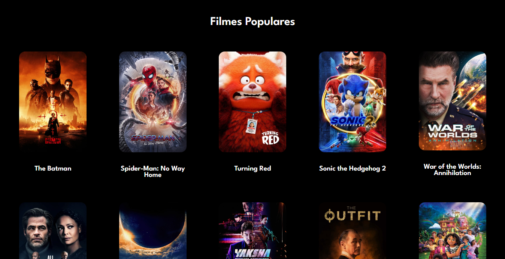
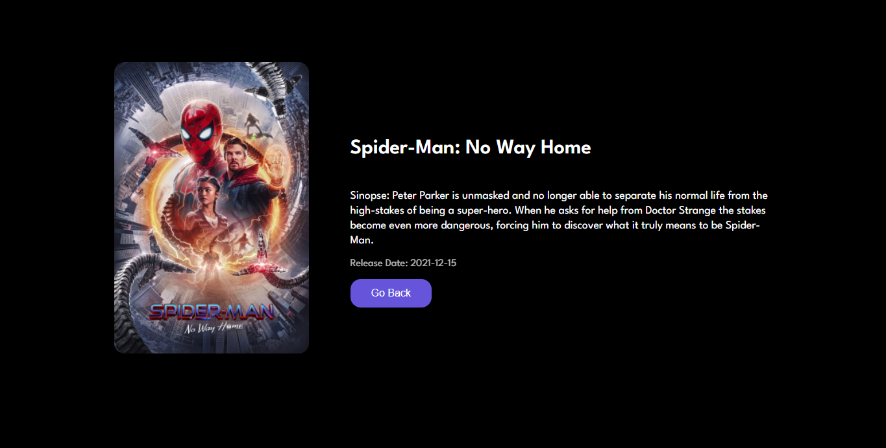

# Consume Movies at The Movie DB API

Page of movies consuming API for study of ReactJS 

<p align="center">
    
    
</p

---
<br/>

## 💻 Tecnologies
- Javascript
- ReactJS
- Styled Components

<br/>

## 🚀 Starting

Clone project for your PC

```bash
$ git clone https://github.com/DenilsonMelo/consume-movies-api.git && cd consume-movies-api
```
Follow steps

## ⚠ Attention
<strong>Change the file 'src/config/key.js' with your api key</strong>

<br/>

```bash
# Install dependencies
$ npm

# Run project
$ npm start
```

Open [http://localhost:3000](http://localhost:3000) in your Browser.

